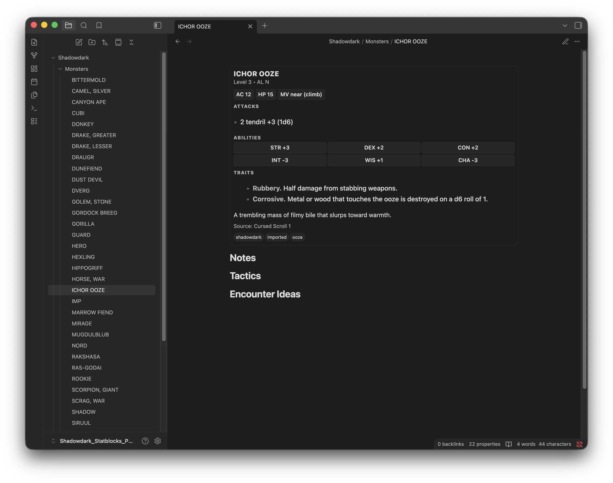
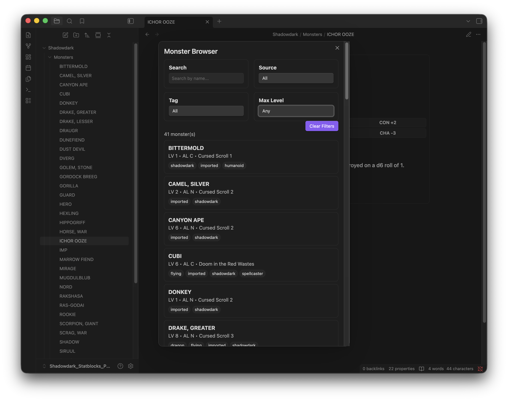
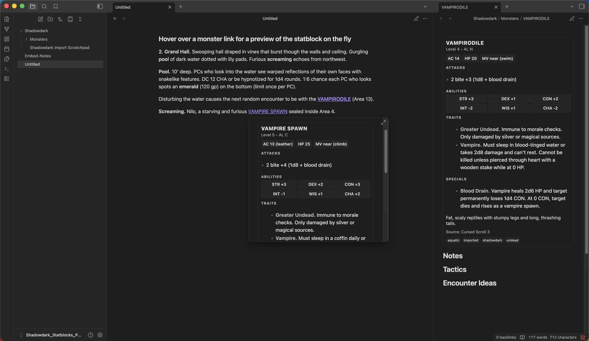
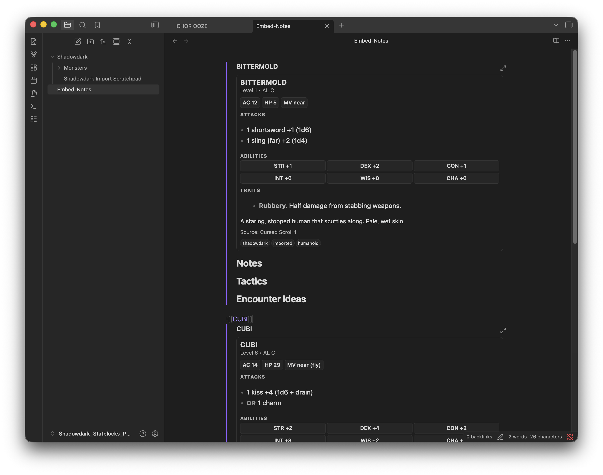
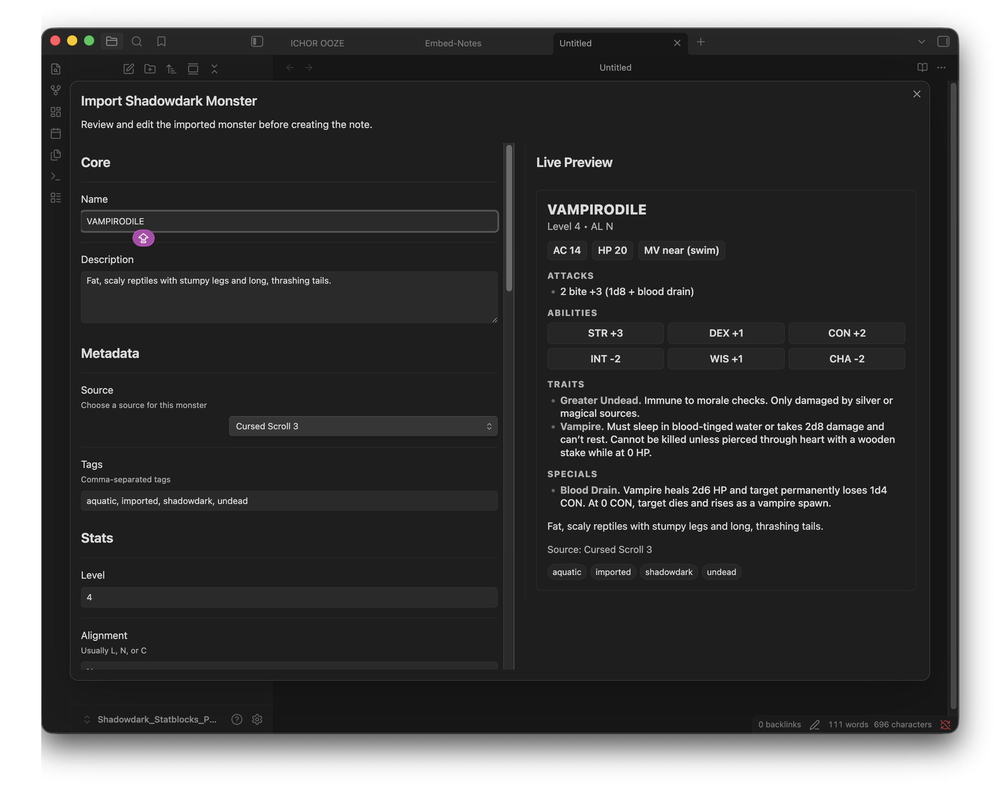
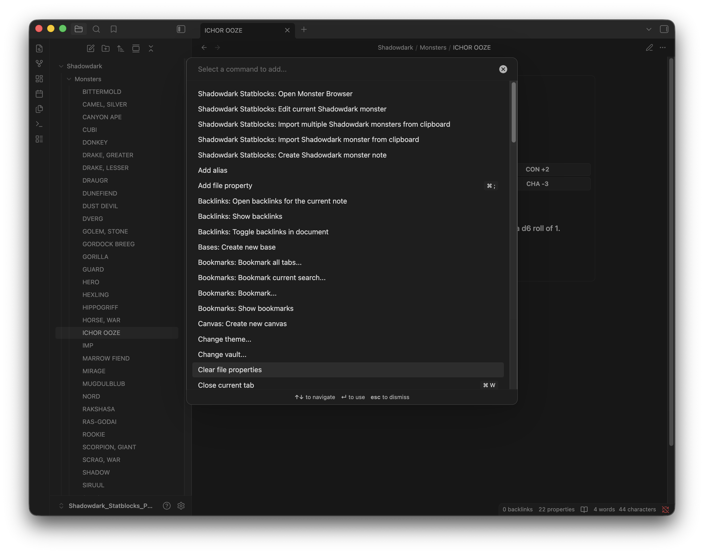
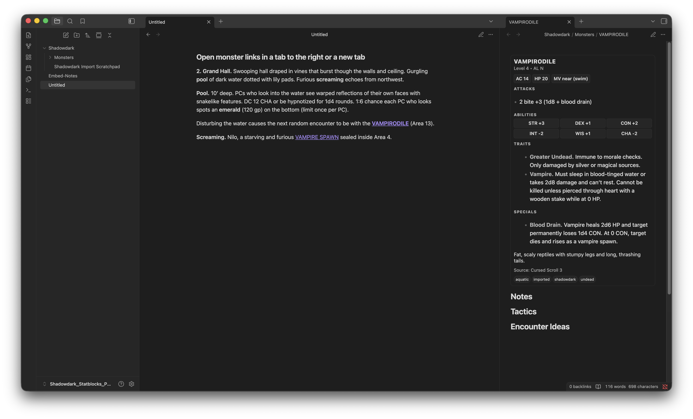

# Shadowdark Statblocks for Obsidian

A powerful Obsidian plugin for importing, managing, and rendering **Shadowdark RPG monster statblocks** directly in your notes.

Designed for GMs who want fast workflows, clean formatting, and seamless integration into session prep.


## Features

### Import Monsters (Clipboard or Selection)

- Paste raw statblocks directly from PDFs or text

- Automatic parsing into structured monster notes

- Supports inconsistent PDF formats (multi-block pages, split entries, etc.)

### Bulk Import Workflow

- Detects multiple monsters from pasted text

- Step-through preview for each monster

- Options:

  - Import

  - Skip

  - Cancel

- Smart summary at the end (imported, skipped, failed)

### Smart Defaults

- Automatically suggests:

  - Tags (undead, dragon, aquatic, etc.)

  - Source (remembers last used)

- Reduces manual cleanup during imports

### Duplicate Handling

- Single import:

  - Prompt to overwrite or create a copy

- Bulk import:

  - Safe mode (creates copies automatically)

### Monster Browser

- Search and filter monsters by:

  - Name

  - Source

  - Tag

  - Max Level

- Instant results

- Hover preview for full statblock

### Live Statblock Rendering
Statblocks automatically render from frontmatter:

- In monster notes

- In hover previews

- In embedded notes

No extra steps required.

### Embeds Just Work
```
![[Bittermold]]
```
Renders a full statblock inline in your notes.


## Quick Start

### 1. Create a Monster Note
Use command: 
	Create Shadowdark monster note
### 2. Import a Monster
Copy a statblock from a source pdf → Use command: 
	Import Shadowdark monster from clipboard
### 3. Bulk Import
Copy a full PDF page → Use command: 
	Import multiple Shadowdark monsters from clipboard
### 4. Browse Your Monsters
Use command: Open Monster Browser

## Screenshots










## Full Instructions Guide

See [INSTRUCTIONS.md](INSTRUCTIONS.md) for a complete walkthrough with screenshots.

## Monster Note Format

Monster notes use YAML frontmatter:

```yaml
---
shadowdarkType: monster
name: "Goblin Sneak"
level: 1
alignment: C
ac: 13
hp: 5
mv: near
atk:
  - 1 dagger +2 (1d4)
str: -1
dex: +2
con: +0
int: +0
wis: -1
cha: -1
traits:
  - Sneaky
description: A wiry goblin that stalks the edges of torchlight.
source: Core Rules
tags:
  - goblin
  - shadowdark
---
```
Monster stats imported from PDF or copied to the clipboard will be formated like this and render Statblocks automatically .


## Commands
	•	Insert Shadowdark monster block
	•	Create Shadowdark monster note
	•	Import Shadowdark monster from clipboard
	•	Import Shadowdark monster from selected text
	•	Import multiple Shadowdark monsters from clipboard
	•	Edit current Shadowdark monster
	•	Open Monster Browser
	
## Notes on Importing
	•	Works best with copied text from Shadowdark formatted PDFs
	•	Handles:
		•	Multiple monsters on one page
		•	Split statblocks (name at end)
		•	Some messy PDF text may still require minor cleanup

⸻

## Known Limitations
	•	PDF copy formatting varies by source
	•	Extremely malformed text may fail to parse
	•	Bulk import prioritizes safety (creates copies instead of overwriting)

⸻

## Settings
	•	Monster folder location
	•	Toggle statblock rendering
	•	Hide/show frontmatter properties
	•	Last-used source memory

⸻

## Roadmap

v1.1 (Planned)
	•	Encounter Builder
	•	Monster Images
	•	Build encounters from the browser
	•	Export to notes
	•	Quantity controls

### Future Ideas
	•	Initiative / combat tracker integration
	•	Monster relationships / factions
	•	Advanced filtering (multi-tag, alignment, etc.)

⸻

### Built For GMs

This plugin is built to support fast, flexible prep for Shadowdark campaigns inside Obsidian.

If it saves you time at the table, it’s doing its job.

⸻

### Feedback & Issues

Found a bug or have an idea?

Open an issue or share feedback — improvements are ongoing.

⸻

## Buy me a coffee
[Buy me a coffee](https://buymeacoffee.com/caulfieldsbrain)


## License
MIT License

Copyright (c) 2026 Alex Lambert

Permission is hereby granted, free of charge, to any person obtaining a copy
of this software and associated documentation files (the "Software"), to deal
in the Software without restriction, including without limitation the rights
to use, copy, modify, merge, publish, distribute, sublicense, and/or sell
copies of the Software, and to permit persons to whom the Software is
furnished to do so, subject to the following conditions:

The above copyright notice and this permission notice shall be included in all
copies or substantial portions of the Software.

THE SOFTWARE IS PROVIDED "AS IS", WITHOUT WARRANTY OF ANY KIND, EXPRESS OR
IMPLIED, INCLUDING BUT NOT LIMITED TO THE WARRANTIES OF MERCHANTABILITY,
FITNESS FOR A PARTICULAR PURPOSE AND NONINFRINGEMENT. IN NO EVENT SHALL THE
AUTHORS OR COPYRIGHT HOLDERS BE LIABLE FOR ANY CLAIM, DAMAGES OR OTHER
LIABILITY, WHETHER IN AN ACTION OF CONTRACT, TORT OR OTHERWISE, ARISING FROM,
OUT OF OR IN CONNECTION WITH THE SOFTWARE OR THE USE OR OTHER DEALINGS IN THE
SOFTWARE.


